# IntelliJ Naruto Progress Bar

This is [a plugin](https://plugins.jetbrains.com/plugin/19302-naruto-progress/versions)
for [JetBrains IntelliJ IDEA](https://www.jetbrains.com/idea/) (And other compatible IDEs), which replaces your progress
bars with a (random) shinobi from Naruto anime and replaces loading spinners with spinning shurikens. Preferences are
located under `Preferences > Appearance & Behaviour > Naruto Progress`.

If you like the plugin, please consider [rating it on the Marketplace](https://plugins.jetbrains.com/plugin/19302-naruto-progress/reviews)
or [starring it on Github](https://github.com/law-millenium/naruto-progress)!

## Included shinobis

### Konoha

* 
  Naruto 
*  Naruto
  with Kyubi
  envelope 
* 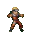 
  Naruto in sexy jutsu mode
  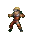
* 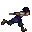
  Sasuke
  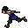
* 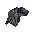
  Sasuke with cursed seal
  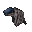
* 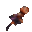 
  Sakura 
* 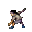
  Neji 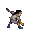
* * 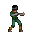
  Drunk Rock Lee 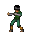
* 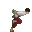
  Tenten 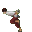
* 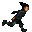
  Shikamaru 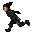
* 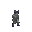
  Choji 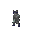
* 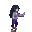
  Hinata 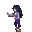
* 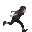
  Shisui 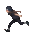
* 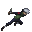
  Kakashi 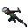
* 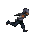
  KakashiAnbu 
* 
  Kurenai 
* 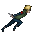
  Minato 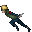
* 
  Tobirama 

### Kumo

* 
  Yugito 

### Akatsuki

* 
  Tobi 
* 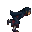
  Itachi 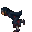

### Bingo Book
* 
  Madara 
* 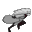
  Madara in Rikudo mode 

### Boruto
* 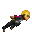
  Boruto 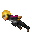
* 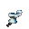
  Mitsuki 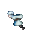

[comment]: <> (end-included-shinobis)

## Contributing

Contributions are very welcome on this project! Contributions can take the form of bug reports, feature requests,
shinobis requests or more!

## Acknowledgements

* The idea for this plugin came from [Pokemon Progress Bar](https://plugins.jetbrains.com/plugin/15090-pokemon-progress)
